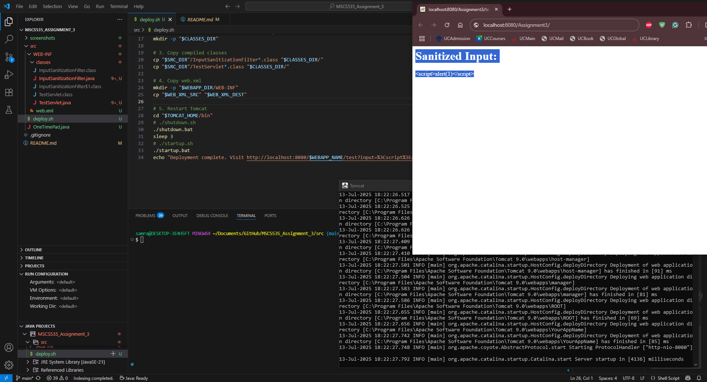
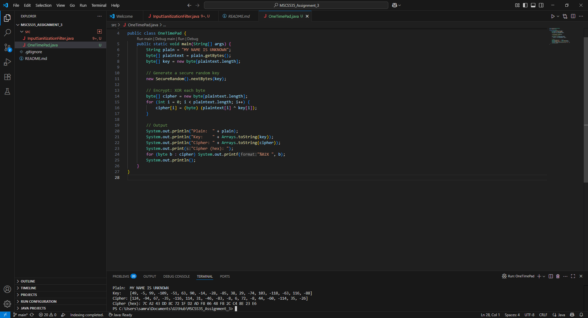

# MSCS535_Assignment_3
OSI Application Layer Security & One-Time Pad Encryption Assignment

Contents:
---------
1. ApplicationSecurity/InputSanitizationFilter.java
   - Java Servlet Filter for input sanitization (protection against XSS/Injection, OSI Layer 7).
   - Use with a Java web application (add to web.xml as filter).

2. ApplicationSecurity/web.xml
   - Minimal web.xml for filter registration.

3. OTP_Encryption/ParallelOTP.java
   - Java implementation of One-Time Pad encryption with parallel processing.
   - To run: javac ParallelOTP.java && java ParallelOTP

How to use:
-----------
- For ApplicationSecurity: Deploy in a Java Servlet web project.
- For screenshots: See the `screenshots` folder for example output images.  

- For OTP_Encryption: Compile and run ParallelOTP.java for a demo of OTP encryption using parallel arrays.
 

# User Guide
- use bash

